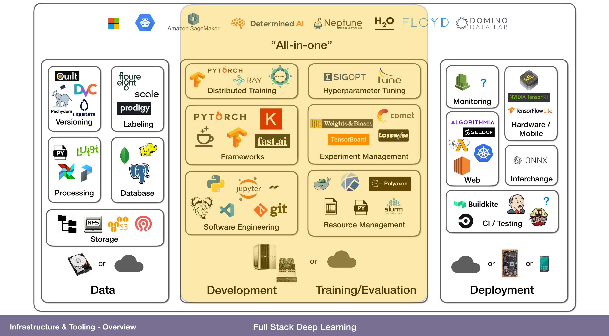

# Infrastructure and Tooling


As always, please [submit a pull request](https://github.com/full-stack-deep-learning/course-gitbook) if any information is out of date! 


## Slides



## Videos













