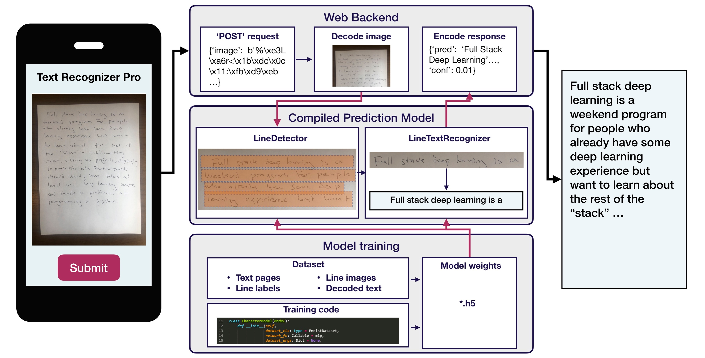

# Labs

The course project is broken up into 8 labs: [https://github.com/full-stack-deep-learning/fsdl-text-recognizer-project](https://github.com/full-stack-deep-learning/fsdl-text-recognizer-project)

Feel free to follow along, and submit pull requests to the source repo if you'd like to make changes: [https://github.com/full-stack-deep-learning/fsdl-text-recognizer](https://github.com/full-stack-deep-learning/fsdl-text-recognizer)

## Videos



