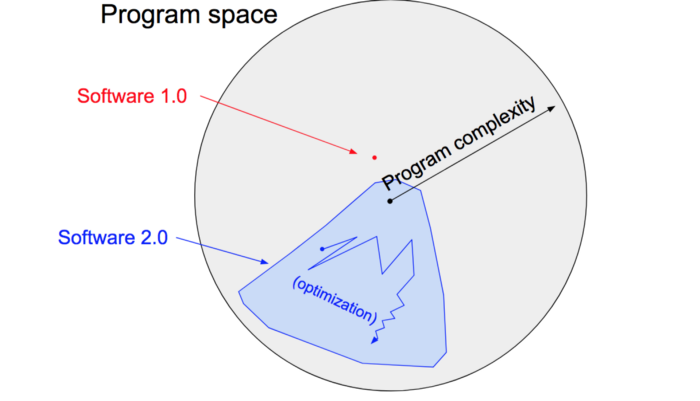

# Andrej Karpathy \(Tesla\)



### Andrej's Landmark Post - "[Software 2.0](https://medium.com/@karpathy/software-2-0-a64152b37c35)"

* **Software 1.0** consists of explicit instructions to the computer written by a programmer.
* **Software 2.0** can be written in much more abstract, human unfriendly language, such as the weights of a neural network.
* In software 2.0, we restrict the search to a continuous subset of the program space where the search process can be made efficient with back-propagation and stochastic gradient descent.

### Programming In The 2.0 Stack

* If optimization is doing most of the coding, what are the humans doing?
  * 2.0 programmers label data
  * 1.0 programmers maintain the surrounding "dataset infrastructure":
    * Visualize data
    * Create and edit labels
    * Bubble up likely mislabeled examples
    * Suggest data to label
    * Flag labeler disagreements
* **Data labeling** is highly iterative and non-trivial.
  * Lane lines are different across the world.
  * Cars have different shapes and sizes.
  * Even traffic lights and traffic signs can be ambiguous.
* **Label imbalances** are very frequent.
* **Data imbalances** are very common.

⇒ **Realistic datasets**: high label and data imbalances, noisy labels, highly multi-task, semi-supervised, active.

### 2.0 IDEs

* Show a full inventory and statistics of the current dataset.
* Create and edit annotation layers for any data point.
* Flag, escalate, and resolve discrepancies in multiple labels.
* Flag and escalate data points that are likely to be mislabeled.
* Display predictions on an arbitrary set of test data points.
* Auto-suggest data points that should be labeled.

⇒ **Can we build GitHub for Software 2.0?**

