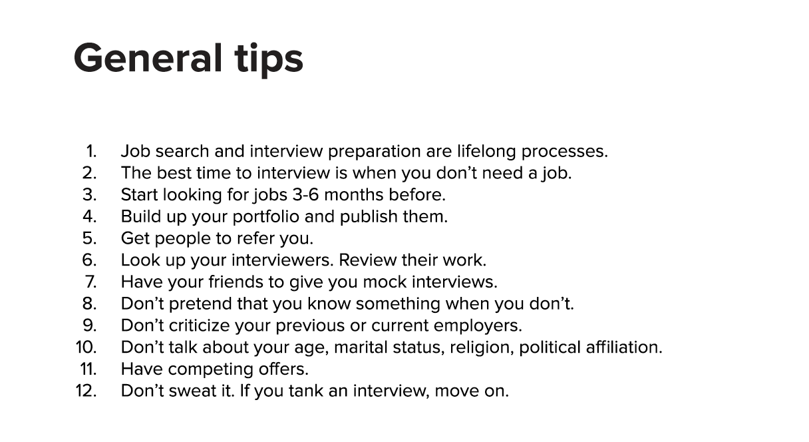

# Chip Huyen \(Snorkel\)



### Machine Learning Jobs

#### Research vs Applied Research

* Research finds the answers to **fundamental** questions and expands the body of theoretical knowledge. Applied research finds solutions to **practical** problems.
* Research focuses on **long-term** outcomes, while applied research focuses on **immediate** commercial outcomes.
* Most cutting-edge research is spearheaded by **big corporations**.
* Machine learning research is highly **empirical** at this point.

#### Research Scientist vs Research Engineer

* A research scientist develops **original** ideas, while a research engineer **actualizes** those ideas.
* **A Ph.D. degree** is often required for research scientist roles.
* Starting as a research engineer is a natural path to become a research scientist.
* In some organizations, these roles often **overlap**.

#### Data Scientist vs Machine Learning Engineer

* A data scientist **extracts knowledge and insights** from data, while a machine learning engineer **builds models** to turn data into products.
* Engineering skillset is **a top priority** for the latter.
* ML Engineers at **startups** might spend more time on cleaning data, setting up infrastructure, and deploying models than training models.

#### Big Companies vs Startups

* Big companies can afford research, while startups cannot.
* Big companies can afford specialists, while startups need generalists.
* Big companies have a standardized hiring process, while startups make up the process as they go.

### Getting a Machine Learning Job

#### Six Common Paths

1. BS/MS in ML → ML Engineer \(Tech Ivies → FAANG/Startups\)
2. Ph.D. in ML → ML Researcher \(Published at Top-Tier Conferences → FAANG/ML-First Startups\)
3. Data Scientist → On-The-Job Training → ML Engineer/ML Researcher \(Data Scientists in companies that want to start using ML\)
4. Software Engineer → Courses → ML Engineer \(Software Engineers who want to transition into ML\)
5. Adjacent Fields → On-The-Job Training → ML Researcher \(Ph.D. from fields like physics, math, neuroscience\)
6. Unrelated Fields → Residency/Fellowship → ML Researcher \(People in fields like healthcare, architecture, art, etc. who go through programs in big companies\)

#### Senior Role vs Junior Role

* Companies hire senior roles for **skills** and junior roles for **attitude**.

#### Ph.D. or Nah?

* The only role that might require a Ph.D. is **\(applied\) research scientist**.
* We need **more engineers** to improve and productize research.

### Understanding The Interviewers' Mindset

* **Companies Hate Hiring**:
  * Expensive for companies.
  * Stressful for hiring managers.
  * Boring for interviewers.
* Companies want the best people who can do **a reasonable job** within **time and monetary constraints**.
* Companies **don't know what they are hiring for**. The job descriptions are for reference purposes only.
* Most recruiters rely on **weak signals** such as previous employers, degrees, awards/papers, GitHub/Kaggle, and referrals.
  * Placing too much importance on voluntary activities \(like contributing to open-source or participating in Kaggle competitions\) **punishes** candidates from **less privileged** backgrounds.
* Most interviewers have **little or no training** \(even at big companies\).
* The interview outcome depends on **many random variables**. They do not reflect your ability or your self-worth.

### Interview Process

#### The Steps

1. Resume Screen
2. Phone Screen
3. Coding Challenges or Take-Home Assignments
4. Technical Offsite Interviews \(1-2\)
5. Onsite Interviews \(4-8\)

#### Bad Interview Questions

1. Questions that ask for retention of knowledge that can be easily looked up.
2. Questions that evaluate irrelevant skills.
3. Questions whose solutions rely on a single insight.
4. Questions that try to evaluate multiple skills at once.
5. Questions that use specific hard-to-remember names.
6. Open-ended questions with one expected answer.
7. Easy questions during later interview rounds.

⇒ For **good interview questions,** check out [this list](https://github.com/chiphuyen/machine-learning-systems-design/blob/master/content/exercises.md) curated by Chip's herself.

#### Alternative Interview Formats

* Multiple choice quiz
* Code debugging
* Pair programming
* Good cop, bad cop

### Recruiting Pipeline

* The higher the onsite-to-offer ratio, the more likely offers are accepted.
* Most junior roles are sourced through campus or referrals.
* "**Be so good they can't ignore you**"
* Candidates with negative experiences are less likely to accept offers.

