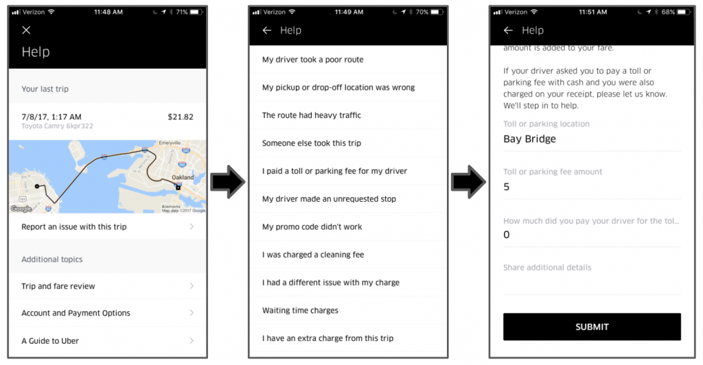

# Jai Ranganathan \(KeepTruckin\)



### Uber's [Customer Obsession Ticket Assistant](https://eng.uber.com/cota/) \(COTA\)

* A tool that uses machine learning and natural language processing techniques to help agents deliver better customer support.
* Enables quick and efficient issue resolution for more than 90 percent of Uber's inbound support tickets.

### Challenge

As Uber grows, so does the volume of support tickets

* Millions of tickets from riders, drivers, and eaters per week
* Global-scale of serving 600+ cities
* Thousands of different types of issues users may encounter
* Multilingual support

### Customer Support Platform

* Steps in the workflow
  * User → Select Flow Node → Write Message → Contact Ticket → Customer Support Representative → Select Contact Type → Lookup Info and Policies → Select Action → Write Response Using a Reply Template → Response → User
* Problems to solve
  * Issue prediction
  * Issue categorization
  * Ticket routing
  * Ticket volume
  * Policy optimization
  * Auto-response

### Exploration

* Identify the right problems to solve
  * Use **analytics** to understand the value before all else
  * Know what **metrics** to optimize for
* Understand whether Machine Learning is a good fit
* Build with an eye on the **probabilistic** nature of Machine Learning solutions

### Development

* Many possible solutions including basic Machine Learning techniques
* Understand the cost-benefit of compute time vs accuracy
* Deep learning is a fast-evolving space - keep up with the literature to understand the latest advances
* Validate your results with visualization

### Deployment

* Architecture complexity with feature engineering and training have special needs
* Deep learning is still slow! Distributed deep learning can help a lot and is getting better
* Good experiment design required to validate the models

### Monitoring

* Dynamic business problems require retraining strategies with well thought out safe deployment
* Continuous improvement of labeling will make your models better
* Look for edges where your models fail to find room for model improvements

