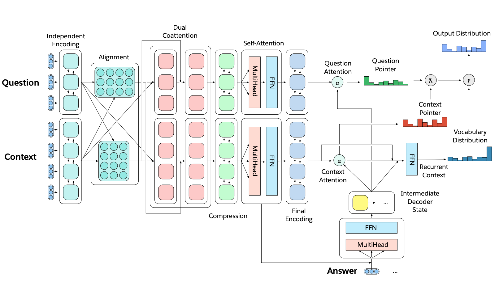

# Richard Socher \(Salesforce\)



### Why Unified Multi-Task Models for NLP?

* **Multi-task learning** is a blocker for general NLLP systems.
* **Unified models** can decide how to transfer knowledge \(domain adaptation, weight sharing, transfer learning, and zero-shot learning\).
* Unified **AND** multi-task models can:
  * More easily adapt to new tasks.
  * Make deploying to production X times simpler.
  * Lower the bar for more people to solve new tasks.
  * Potentially move towards continual learning.

### The 3 Major NLP Task Categories

1. **Sequence tagging**: named entity recognition, aspect specific sentiment.
2. **Text classification**: dialogue state tracking, sentiment classification.
3. **Sequence-to-sequence**: machine translation, summarization, question answering.

⇒ They correspond to the 3 equivalent super-tasks of NLP: **Language Modeling**, **Question Answering**, and **Dialogue**.

### A Multi-Task Question Answering Network for [decaNLP](http://decanlp.com/)

#### Methodology

* Start with a context.
* Ask a question.
* Generate the answer one word at a time by:
  * Pointing to context.
  * Pointing to question.
  * Or choosing a word from an external vocabulary.
* Pointer Switch is choosing between those three options for each output word.

#### Architecture Design

### [decaNLP: A Benchmark for Generalized NLP](https://github.com/salesforce/decaNLP)

* Train a single question answering model for multiple NLP tasks \(aka questions\).
* Framework for tackling:
  * More general language understanding.
  * Multi-task learning.
  * Domain adaptation.
  * Transfer learning.
  * Weight-sharing, pre-training, fine-tuning.
  * Zero-shot learning.

